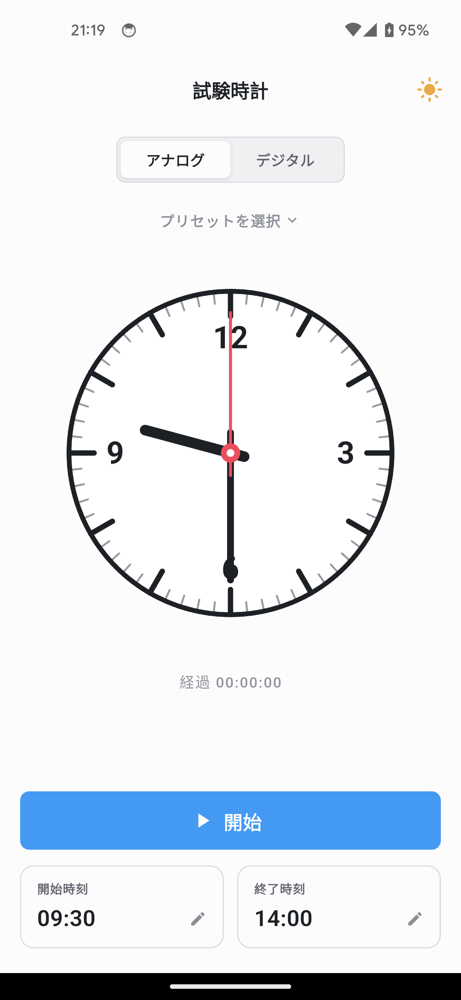
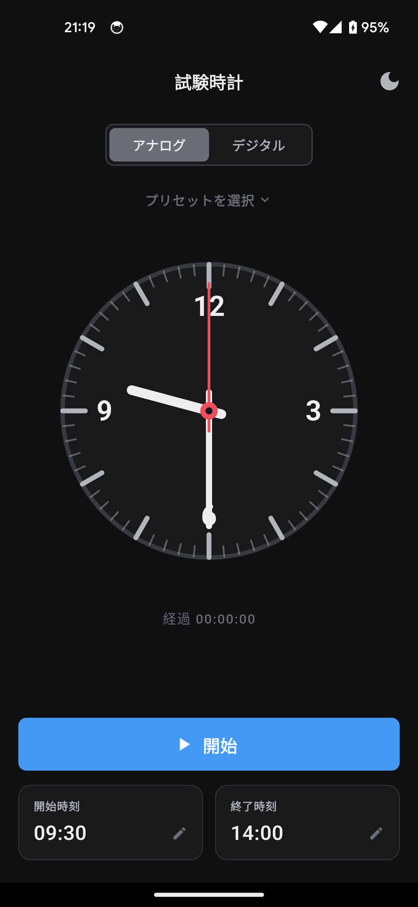

# 試験時計 (Shiken Dokei)

試験本番のシミュレーションとして、設定した**開始時刻**から時を刻むデジタル/アナログ時計を表示する Flutter アプリです。試験の実際の開始時刻に合わせて時計を進め、本番同様の時間感覚でテストを受ける体験を提供します。

> 旧バージョンは Flask + JavaScript 実装でしたが、Flutter（全プラットフォーム対応）に置き換えました。

## 画面

<p align="center">
  
  &nbsp;&nbsp;
  
</p>

デザインシステムのトークンに沿ったビジュアルで、**ライト / ダークテーマ**に対応します。

## 機能

- **1画面構成**
- **デジタル / アナログ表示の切り替え**（上部のセグメントボタン）
- **ライト / ダークテーマ** — 起動時は OS 設定に追従。AppBar 右上の太陽 / 月アイコンで切替でき、選択は端末に保存（`shared_preferences`）して次回起動でも維持します
- **開始時刻の設定**（時・分・秒）— 設定すると時計はその時刻にセットされ、進行は止まります
- **終了時刻の設定**（時・分・秒）
- **プリセット**（名称＋開始時刻＋終了時刻）— 「東大入試1日目1限 国語 / 開始 09:30 / 終了 12:00」のようなセットを保存しておき、選択するだけで開始・終了時刻を一括設定できます。アプリ内で追加・編集・削除でき、**バックエンド不要・端末ローカル**（`shared_preferences`）に保存されます
- **開始 / 停止ボタン** — 開始で時を刻み始め、押すと「停止」に変わり止められます
- **設定操作でも進行は停止**します
- **終了時刻に到達すると音が鳴り、「試験終了」のオーバーレイを表示**します。「元の画面に戻る」ボタンで元の表示に戻ります（画面遷移はしません）

## 構成

```
lib/
  main.dart                       アプリのエントリポイント（テーマ接続）
  clock_screen.dart               メイン画面（状態機械・タイマー・終了オーバーレイ）
  preset_store.dart               プリセットの端末ローカル保存（shared_preferences）
  models/
    exam_preset.dart              プリセットのデータモデル（名称・開始・終了）
  theme/
    app_colors.dart               DSトークンの ThemeExtension（ライト/ダーク色）
    app_theme.dart                ライト/ダークの ThemeData
    theme_controller.dart         テーマの保存・トグル（ChangeNotifier）
  widgets/
    analog_clock.dart             CustomPainter によるアナログ時計（秒針=赤）
    digital_clock.dart            HH:MM:SS デジタル表示
    time_setting_dialog.dart      時/分/秒の3列ホイールピッカー（開始・終了で共用）
    preset_edit_dialog.dart       プリセットの新規作成・編集ダイアログ
    preset_manager_sheet.dart     プリセットの一覧・選択・追加・編集・削除
assets/
  sounds/alarm.wav                試験終了アラーム音
export/                           アプリアイコン素材（マスター + Android アダプティブ2レイヤー）
```

依存パッケージ:
- [`audioplayers`](https://pub.dev/packages/audioplayers)（アラーム再生）
- [`shared_preferences`](https://pub.dev/packages/shared_preferences)（プリセット・テーマ設定の端末ローカル保存）
- [`flutter_launcher_icons`](https://pub.dev/packages/flutter_launcher_icons)（アプリアイコン生成 / dev）

## セットアップと実行

各 OS のプラットフォーム雛形（`android/` `ios/` `web/` `macos/`）はリポジトリに含まれています。

```bash
flutter pub get
flutter analyze
flutter test
flutter run              # 接続した実機 / エミュレータで起動
flutter run -d chrome    # Web ブラウザで起動する場合
```

> Flutter SDK のインストールが必要です: https://docs.flutter.dev/get-started/install

## アプリアイコン・配布準備

アイコンは時計の枠に定規と鉛筆を針として組み合わせた「試験 × 時間」のモチーフです。
素材は `export/` に置いています。

| ファイル | 用途 |
|---|---|
| `export/appicon_1024.png` | マスター（1024 / iOS・汎用ソース） |
| `export/appicon_android_foreground_432.png` | Android アダプティブ用 前景レイヤー |
| `export/appicon_android_background_432.png` | Android アダプティブ用 背景レイヤー |

各プラットフォームへの適用は `flutter_launcher_icons`（設定は `pubspec.yaml`）で行います。

```bash
flutter pub get
dart run flutter_launcher_icons
```

これで iOS / Android（アダプティブ含む）/ web / macOS のアイコンが生成・差し替えされます。

アプリの表示名は全プラットフォームで **「試験時計」** に設定済みです
（Android: `AndroidManifest.xml`、iOS: `Info.plist` の `CFBundleDisplayName`、web: `index.html` / `manifest.json`）。

### リリースビルド

```bash
flutter build apk --release        # Android（APK）
flutter build appbundle --release  # Android（Play ストア向け AAB）
flutter build ios --release        # iOS（要 Xcode 署名設定）
flutter build web --release        # Web
```

> 配布にあたっては、アプリケーション ID / バンドル ID（現在 `com.example.shikendokei`）の変更と、各ストアの署名設定が別途必要です。

## 動作確認チェックリスト

- [ ] アナログ / デジタルの切り替えが効く
- [ ] ライト / ダークの切替が効き、再起動後も選択が保持される
- [ ] 開始時刻を設定すると時・分・秒が変更でき、時計がその時刻にセットされる
- [ ] 開始ボタンで秒が進み、「停止」ボタンに変わって止められる
- [ ] 時刻設定の操作で進行が止まる
- [ ] 終了時刻を直近に設定して開始すると、終了時刻で音が鳴り「試験終了」が表示される
- [ ] 「元の画面に戻る」でオーバーレイが閉じる（画面遷移しない）
- [ ] プリセットを追加・編集・削除でき、アプリを再起動しても保持される
- [ ] プリセットを選択すると開始時刻・終了時刻が一括でセットされる
