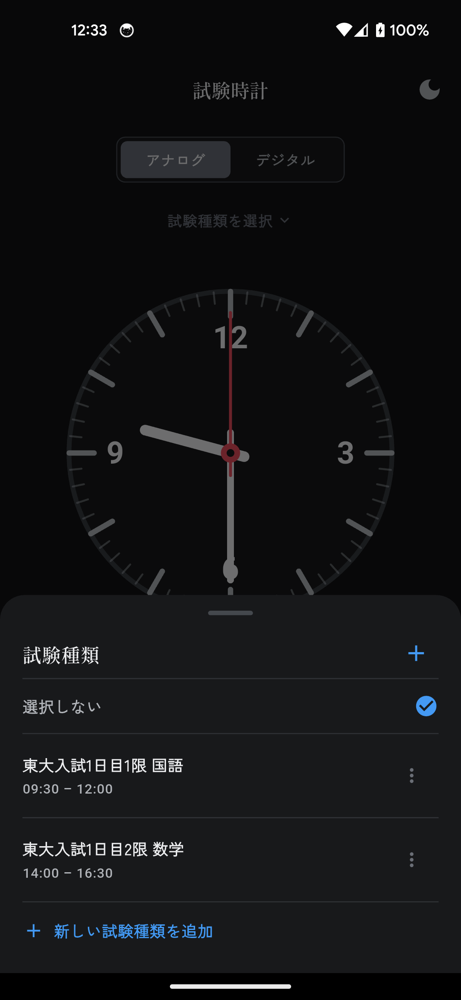

# 試験時計

試験本番のシミュレーションとして、設定した**開始時刻**から時を刻むデジタル/アナログ時計を表示する Android アプリです。試験の実際の開始時刻に合わせて時計を進め、本番同様の時間感覚でテストを受ける体験を提供します。

## 画面

  
  &nbsp;&nbsp;
  
  &nbsp;&nbsp;
  

メイン画面（ライト / ダーク）と、試験種類の登録・選択

**ライト / ダークテーマ**に対応し、よく使う開始・終了時刻を「試験種類」として登録できます。

## ダウンロード / インストール（Android）

最新版の APK は **[リリースページ](https://github.com/TatsuhitoYoshikawa/shikendokei_app/releases/latest)** から入手できます。

1. リリースページの `shikendokei-vX.Y.Z.apk` をスマホでダウンロード
2. 初回は「**提供元不明のアプリ**（不明なアプリのインストール）」の許可を、使用するブラウザ/ファイルアプリに対して有効化
3. APK をタップしてインストール
4. 「Play プロテクト」の警告が出たら「**詳細 → インストール**」

※ 初回起動時に、表示フォントの取得のためインターネット接続が必要です。

## 機能

- **デジタル / アナログ表示の切り替え**（上部のボタン）
- **ライト / ダークテーマ** — 起動時は端末（OS）の設定に追従。右上の太陽 / 月アイコンでいつでも切り替えでき、選んだテーマは次回起動でも維持されます
- **開始時刻・終了時刻の設定**（時・分・秒）— 時計は設定した開始時刻にセットされます
- **開始 / 停止** — 開始ボタンで時を刻み始め、もう一度押すと止まります
- **試験種類の登録** — 「東大入試1日目1限 国語（09:30〜12:00）」のように、名称と開始・終了時刻のセットを保存しておけます
  - 選ぶだけで開始・終了時刻を一括設定
  - 追加・編集・削除が可能。「選択しない」を選べば未選択の状態にも戻せます
  - 登録内容は端末内にのみ保存されます
- **試験終了のお知らせ** — 終了時刻になるとアラーム音が鳴り、「試験終了」を表示します。「元の画面に戻る」で戻れます

## プライバシー

試験種類やテーマの設定など、入力・選択した情報は**すべて端末内にのみ保存**されます。外部のサーバーへ送信することはありません。

---

本アプリは Flutter 製のオープンソースです。開発者向けのセットアップは Flutter SDK を導入のうえ `flutter pub get` → `flutter run` で起動できます。
